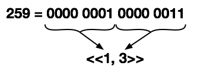

# Variables, types et opérateurs 

Dans ce chapitre, nous allons passer en revue les différents types et opérateurs, en regardant en détail ce qui rapproche et différentie Elixir d'Erlang. Elixir tire beaucoup d'Erlang, et en lisant ce qui suit, vous devriez rapidement voir apparaitre le point de divergence entre les deux. Ce point est cependant plus faible qu'il n'y parait, mais suffisamment important pour que vous preniez bien le temps de tester ce qui va être présenté dans les pages suivantes. 

Vous pourrez avoir l'impression que certains sujets seront traités très rapidement. Rassurez-vous, nous y reviendrons, quand cela s’avèrera nécessaire, au cours des prochains chapitres. Dans les exemples qui vont suivre, je partirais indifféremment d'Erlang ou d'Elixir, mais je n'exclus pas de m'attarder sur certains points plus spécifiques à l'un ou l'autre.

## Variables et pattern matching

Avec Erlang, les variables commencent par un underscore (`_`) ou une majuscule (`[A-Z]`), suivi de n'importe quel caractère alpha numérique ou underscore (`[a-zA-Z0-9_]`). Avec Elixir, la seule différence vient du fait que le premier caractère, s'il n'est pas un underscore, doit être une minuscule (`[a-z]`). 

Le principe de base pour l'utilisation des variables repose sur le _pattern matching_. Pour Erlang, le symbole égal (`=`) est un opérateur de _pattern matching_ qui se comporte comme un opérateur d'assignation sur la variable ciblée si elle n'est liée à aucune valeur. Il en est de même avec Elixir à la différence qu'avec ce dernier, les variables ne sont pas en _single assignemt_ comme c'est le cas avec Erlang. Ceci a son importance et si jamais il n'y a pas de correspondance de pattern lors de l'utilisation du égal avec Elixir, ce dernier fera une réassignation de la variable ciblée.

Prenons l'exemple suivant avec Erlang :

```
1> [X, Y, Z] = [1, 2, 3].
[1,2,3]
2> X = 4.
** exception error: no match of right hand side value 4
```

L'erreur renvoyée ici est logique, dans un contexte de _pattern matching_ et de _single assignment_. En acceptant la réassignation, il pourrait y avoir une ambiguïté poussant à dire que 1 est égal à 4. 

Avec Elixir, nous pouvons faire ceci : 

```
ex(1)> a = [x, y, z] = [1, 2, 3]
[1, 2, 3]
iex(2)> x = 4
4
iex(3)> a
[1, 2, 3]
```

Dans cet exemple, Elixir a agi en utilisant le principe d'assignation pour affecter, respectivement les valeurs `1`, `2`, `3` et `[1, 2, 3]` aux variables `x`, `y`, `z` et `a`. Puis, _oubliant les principes de pattern matching_, il a réappliqué ce même principe pour modifier le contenu de `x`. Notez cependant que le contenu de `a` n'a pas changé.

Déclarer qu'Elixir à _oublié_ les principes du pattern matching pour réaffecter la valeur `4` à `x` est un abus de langage. Cette possibilité est simplement liée au fait qu'Elixir ne fait pas de _single assigment_ et donc que dans le cas ou n'y a pas de matching, il fait de la réassignation. C'est cependant une première différence très importante entre les deux langages.

L'intérêt du _single assignment_ réside dans le fait d'assurer que la valeur pointée par une variable ne changera jamais, tout au long de la vie du programme. Ceci a pour conséquence de faciliter la découverte de problème en cas de mauvaise assignation de la valeur de cette variable. En effet, dans un tel cas, il suffit de retrouver la fonction en charge de cette assignation pour corriger le problème. Avec le _multi assignment_ d'Elixir, cet avantage est perdu. Mais cette perte, associée au principe de _pattern matching_, ouvre la porte à une facilité accrue pour la manipulation du contenu des variables. Le meilleur exemple de ceci est certainement la permutation de valeurs :

```
{a, b} = {b, a}
```

## Les variables _ignorées_

Que cela soit avec Erlang ou Elixir, la convention veut que l'underscore en début d'une variable indique que nous allons _ignorer_ son contenu. Imaginons que nous ayons une fonction qui retourne un tuple de deux valeurs :

Elixir:
```
{v1, v2} = une_fonction()
```

Erlang:
```
{V1, V2} = un_fonction().
```

Si dans la suite de notre programme nous n'utilisons jamais `v1` (respectivement `V1`), lors de la compilation, Elixir nous renverra le message suivant : 

```
test.ex:7: variable v1 is unused
```

Suivant en cela ce que ferait Erlang :

```
test.erl:3: Warning: variable 'V1' is unused
```
 
Ce message n'est qu'un _warning_ et n'a donc aucune incidence sur le bon fonctionnement de notre programme. Cependant nous pouvons l'éviter en écrivant ceci :

Elixir:
```
{_v1, v2} = une_fonction()
```

Erlang:
```
{_V1, V2} = un_fonction().
```

Dans ce cas, nous pouvons tout de même manipuler la variable `_v1` (respectivement `_V1`). Dans la plus part des cas, il plus courant d'utiliser un simple underscore pour signaler un contenu à ignorer :

Elixir:
```
{_, v2} = une_fonction()
```

Erlang:
```
{_, V2} = un_fonction().
```

Cette écriture est plus conscise mais il faut savoir qu'il est impossible d'accéder au contenu de la variable `_` :

Elixir:
```
iex(3)> {_, v2} = une_fonction()
{1, 2}
iex(4)> _
** (ErlangError) erlang error: {:unbound_var, :_}
    :erl_eval.exprs/2
```

Erlang:
```
3> {_, V2} = une_fonction().
{1,2}
4> _.
* 1: variable '_' is unbound
```

En général, nous utiliserons une variable nommée commençant par un underscore uniquement pour faciliter la lecture et la compréhension du code.

## Les Types Primitifs

### Les entiers et flottants

Que ce soit avec Erlang ou Elixir, les entiers ne sont pas bornés. Et la principale distinction entre les deux langages vient des possibilités offertes pour représenter un entier.

Erlang offre deux manières d'exprimer un entier. Soit en utilisant la forme décimale classique (`123` par exemple) soit en précisant, avant la valeur, et séparé de celle-ci par un dièse (`#`), la base utilisée. Ainsi nous pouvons écrire 255 sous la forme `2#11111111`, `16#FF`, `8#377` mais aussi `12#194`ou encore `7#514`, ...

Cette facilité n'a été conservée que partiellement avec Elixir, ne laissant la possibilité d'exprimer un entier que de manière décimale classique ou sous sa représentation en bases 2, 8 et 16, en préfixant, respectivement, la valeur par `0b`, `0` et `0x` :

```
iex(1)> 0b11111111
255
iex(2)> 0377
255
iex(3)> 0xFF
255
```

Pour la notation décimale, il est possible, avec Elixir, d'utiliser l'underscore ( `_`) comme facilitateur pour la lecture en groupes de trois digits.

```
iex(4)> 1_234_567
1234567
```

Notez cependant qu'il n'y a aucune contrainte sur la position des underscore à l'exception qu'ils ne peuvent pas être placés en première ou dernière position.

```
iex(5)> 1_2_34567
1234567
iex(6)> 123_
** (SyntaxError) iex:6: syntax error before: '_'
```

Concernant les flottants, que ce soit avec Erlang ou Elixir, ils sont codés sur 64 bits. Et il doit toujours y avoir au moins un digit avant et après le point décimal.

```
iex(7)> 2.34
2.34
iex(8)> .34
** (SyntaxError) iex:8: syntax error before: '.'
```

Il est également possible d'utiliser la notation *exposant* en utilisant la lettre `e` pour séparer la mantisse de l'exposant. Notez que la mantisse doit obligatoirement avoir un point décimal avec au moins un digit avant et après.

```
iex(9)> 12e-4
** (SyntaxError) iex:9: syntax error before: e
iex(10)> 12.0e-4
0.0012
```

Pour Erlang c'est la même chose :

```
1> 12e-4.
* 1: syntax error before: e
2> 12.0e-4.
0.0012
```

> Attention au point terminal présenté dans les exemples Erlang ci dessus. Nous y reviendrons un peu plus loin lorsque nous aborderons la ponctuation du langage.

### Les atomes

En Erlang, les atomes sont représentés par une suite de caractères commençant par une minuscule et pouvant contenir l'ensemble des caractères `[a-zA-Z0-9_]`. Il est également possible d'ajouter à cet ensemble tout autre caractère imprimable, mais pour cela il faudra encadrer le terme par de simples quotes. Exemples : `un_atome` ou `'un atome!'`.

Avec Elixir, un atome commencera par le symbole _deux-points_ (`:`), suivi par :

* un ensemble quelconque de caractères, parmi `[a-z-A-Z0-9_]`. Exemple : `:un_atome`
* un ensemble quelconque de caractères imprimables, encadré par des doubles quotes (`"`). Exemple : `:"un atome!"`
* un opérateur Elixir valide. Exemples : `:==`, `:!`, `:&&`, ... 

> Avec l'utilisation des simples et doubles quotes, pour un atome, nous avons donc `'atome'` en Erlang qui est équivalent à `:"atome"` en Elixir.

Les utilisateurs de Ruby auront certainement fait le rapprochement avec les symboles[^RB-SYMBOL]. Pour les autres, nous pouvons les comparer aux constantes, mais, avec comme spécificité qu'il s'agirait de constantes chez lesquelles la valeur serait identique au nom.

[^RB-SYMBOL]: [http://www.ruby-doc.org/core-2.0/Symbol.html](http://www.ruby-doc.org/core-2.0/Symbol.html)

Nous aurons l'occasion de voir comment les utiliser à de nombreuses occasions.

### Les booléens

En Erlang, il n'y a pas, à proprement parlé, de type booléen. Par convention Erlang utilise les atome `true` et `false` pour exprimer un résultat booléen. Avec Elixir nous n'utiliserons pas des atomes, mais les mots clés `true` et `false`. Elixir peut également considérer `nil` comme `false` dans certains contextes. Nous verrons cela un peu plus loin quand nous parlerons des opérateurs.

### Les caratères

Que cela soit en Erlang ou en Elixir, il n'y a pas de type caractère. Un caractère sera représenté par sa valeur ASCII décimale. Il existe cependant une notation qui permet de simplifier la découverte de la valeur ASCII d'un caractère en le préfixant avec un point d'interrogation (`?`) en Elixir (un  dollar - `$` - avec Erlang) :

Elixir :
```
iex(1)> ?c
99
```
 
Erlang :
```
1> $c.
99
```

Ce sucre syntaxique trouve sa limite avec les caractères non imprimables. Ainsi, si dans le shell interactif vous tapez un point d'interrogation, suivi d'un espace, puis vous pressez la touche "entrée", Elixir vous renverra la valeur 32 qui correspond bien au code ASCII de l'espace. Si maintenant vous faites la même chose, mais sans l'espace, Elixir renverra la valeur 10 correspondant au code du caractère de nouvelle ligne (LF). 

### Les listes

Basiquement, avec Erlang, comme avec Elixir, les listes sont représentées par un ensemble de données quelconques séparées par des virgules (`,`) et encadrées par des crochets ( `[]`). 

Elixir:
```
iex(1)> l = [1, 2, 3, 4, 5]
[1, 2, 3, 4, 5]
```

Erlang:
```
1> L = [1, 2, 3, 4, 5].
[1,2,3,4,5]
```

Cependant si l'ensemble des valeurs qui composent une liste correspond à des codes de caractères imprimables, la liste sera alors représenté sous la forme d'une suite de caractères encadrée par de simples quotes (`'`) pour Elixir :

```
iex(2)> [104, 101, 108, 108, 101]
'hello'
```

Pour Erlang, la chaine sera encadrée par des doubles quotes :

```
1> [104, 101, 108, 108, 101].
"hello"
```

Il est donc possible de représenter une chaîne en utilisant la notation entre simples quotes pour Elixir, ou double quote pour Erlang. Nous pourrons alors l'interpréter comme une liste de caractères. Toutes les manipulations que nous pourrons faire sur les listes sont possibles avec cette notation.

Nous pouvons utiliser le principe du _pattern matching_ associé à la syntaxe `[...|...]` pour extraire les éléments d'une liste. Ainsi si nous avons une liste `l`, non vide, et que nous écrivons `[head|tail] = l` alors `head` contiendra le premier élément de la liste et `tail` le *reste* de la liste :

```
iex(2)> [head|tail] = l
[1, 2, 3, 4, 5]
iex(3)> head
1
iex(4)> tail
[2, 3, 4, 5]
```

Il est possible d'extraire les 2, 3, ..., n premiers éléments de la liste en utilisant la notation `[i, j, ..., n | tail]` :

```
iex(5)> [m, n|tail] = l
[1, 2, 3, 4, 5]
iex(6)> m
1
iex(7)> n
2
iex(8)> tail
[3, 4, 5]
```

Erlang supporte également cette forme d'écriture :

```
1> L = [1, 2, 3, 4, 5].
[1,2,3,4,5]
2> [Head|Tail] = L.
[1,2,3,4,5]
3> Head.
1
4> Tail.
[2,3,4,5]
5> [M, N|Tail2] = L.
[1,2,3,4,5]
6> M.
1
7> N.
2
8> Tail2.
[3,4,5]
```

Imaginons maintenant que nous souhaitons récupérer le dernier élément de la liste. Avec Elixir nous allons utiliser la fonction `reverse` du module `Enum` :

```
iex(9)> [last|_] = Enum.reverse(l)
[5, 4, 3, 2, 1]
iex(10)> last
5
```

> Notez l'utilisation de l'underscore comme variable *poubelle*, permettant de signifier que je ne vais pas utiliser la queue de liste.

Si nous pouvons utiliser les fonctions du module `Enum` d'Elixir, sachez qu'il est également possible d'utiliser celle du module `lists` d'Erlang.

Le module `lists` d'Erlang permet de réaliser de nombreuses manipulations sur les listes. Avec Erlang, l'utilisation d'une fonction (appelons-la `f`) du module (appelons-le `m`) se fait en utilisant la syntaxe `m:f(Args)`. Pour utiliser cette même fonction dans Elixir, il faudra utiliser la notation `:m.f(args)`. Ainsi, l'appel de la fonction `reverse` du module `lists` qui se fait comme ceci avec Erlang :

```
1> lists:reverse([1, 2, 3, 4, 5]).
[5, 4, 3, 2, 1]
```
 
Pourra se faire comme ceci avec Elixir :

```
iex(1)> :lists.reverse([1, 2, 3, 4, 5])
[5, 4, 3, 2, 1]
```

Il exite, en Erlang, une notation sur les listes qui n'a malheureusement pas été reportée en Elixir : la notation en _double pipe_. Imaginons que nous ayons une liste d'entiers et que nous souhaitions créer une liste des carrés de ces mêmes entiers. Il faudrait donc parcourir la liste et multiplier chaque valeur par elle-même. La notation "double pipe" permet de faire cela très simplement :

```
1> L = [1, 2, 3, 4].
[1,2,3,4]
2> [X*X || X <- L].
[1,4,9,16]
```

Nous avons donc utilisé une notation sous la forme :

```
[f(X) || X <- L]
```

Ou `f` est la fonction que nous voulons appliquer à chaque élément (`X`) de la liste `L`. Mais nous pouvons aller beaucoup plus loin. En effet, nous ne sommes pas limités à une seule liste. Ainsi, si nous écrivons ceci :

```
[f(X, Y) || X <- L1, Y <-L2]
```
    
Nous créons une nouvelle liste dont les éléments sont constitués du résultat de la fonction `f` appliquée à l'ensemble des combinaisons `(X, Y)` :

```
1> L1 = [1, 2, 3].
[1,2,3]
2> L2 = [10, 20, 30].
[10,20,30]
3> [X+Y || X <- L1, Y <- L2].
[11,21,31,12,22,32,13,23,33]
```

Allons encore plus loin : nous pouvons compléter cette notation en lui ajoutant des conditions :

```
[... || ..., condition]
```

Ainsi, nous pouvons retrouver l'intersection entre deux listes de la façon suivante :

```
1> L1 = [1, 2, 3, 4, 5, 6].
[1,2,3,4,5,6]
2> L2 = [1, 4, 5, 7, 8].
[1,4,5,7,8]
3> [X || X <- L1, Y <- L2, X =:= Y].
[1,4,5]
```

### Les tuples

Que ce soit avec Erlang ou Elixir, il s'agit, comme pour les listes, d'un ensemble de données quelconques séparées par des virgules (`,`), mais encadrées par des accolades (`{}`). 

Elixir:
```
iex(1)> t = {1, :deux, 'trois'}
```

Erlang:
```
1> T = {1, deux, "trois"}
```

Il n'existe pas de notation utilisant le pipe (`|`) pour extraire simplement un élément d'un tuple. Nous pourrons donc extraire des données d'un tuple en passant par un _matching_ :

Elixir:
```
iex(1)> {number, atom, string} = t
{1, :deux, 'trois'}
iex(2)> number
1
iex(3)> atom
:deux
iex(4)> string
'trois'
```

Erlang:
```
1> {Number, Atom, String} = T.
{1,deux,"trois"}
2> Number.
1
3> Atom.
deux
4> String.
"trois"
```

Nous pouvons également utiliser la fonction `element` d'Erlang, simplifiée en `elem` dans Elixir :

Elixir:
```
iex(5)> elem(t, 2)
:deux
```

Erlang:
```
5> element(T, 2).
deux
```

Ces fonction prennent en paramètre le tuple est l'indice de l'élément à récupérer.

Nous pouvons également utiliser la fonction `tuple_to_list`pour transformer notre tuple en liste et accéder aux facilités offertes par cette dernière : 

Elixir:
```
iex(6)> [trois|_] = Enum.reverse(tuple_to_list(t))
['trois', :deux, 1]
iex(7)> trois
'trois'
```

Erlang:
```
6> [Trois|_] = lists:reverse(tuple_to_list(T)).
["trois",deux,1]
7> Trois.
"trois"
```

### Les binaires

Un _binaire_ est représenté par une séquence d'entiers (compris entre 0 et 255) placée entre un double inférieur (`<<`) et un double supérieur (`>>`).

```
iex(1)> b1 = <<1, 2, 3>>
```

Dans le principe, la séquence d'entiers n'est rien d'autre qu'une liste, et nous pouvons donc parfaitement encadrer la séquence par des crochets (`[]`) :

```
iex(2)> b2 = <<[1, 2, 3]>>
```

Et si ceci est vrai, alors nous pouvons également utiliser la notation sous forme de chaine de caractères encadrée par de simples quotes (`'`) :

```
iex(3)> b3 = <<'hello'>>
"hello"
```

Ou des doubles quotes (`"`) avec Erlang :

```
1> B3 = <<"hello">>.
<<"hello">>
```

Vous remarquerez que, dans ce dernier exemple, Elixir a représenté le binaire en reprenant la chaine et en la plaçant entre des doubles quotes (`"`). Ceci nous donne une nouvelle façon de représenter une binaire.

```
iex(4)> <<104, 101, 108, 108, 111>> = <<[104, 101, 108, 108, 111]>>
"hello"
iex(5)> <<104, 101, 108, 108, 111>> = <<'hello'>>
"hello"
iex(6)> <<104, 101, 108, 108, 111>> = "hello"
"hello"
```

De façon très réductrice, un binaire n'est rien d'autre qu'une séquence de bits et peut donc se rapprocher des chaines de caractères (_string_) que l'on connait dans les autres langages. 

> Elixir propose un module `String` pour manipuler les binaires. Malheureusement il ne correspond en rien au module `string` d'Erlang qui s'applique aux listes. Erlang dispose d'un module `binary`.

Erlang offre la syntaxe *Bit*[^ERL-SYNTAX-BIT] qui permet une manipulation très puissante des binaires. Elle a été reprise dans Elixir.

[^ERL-SYNTAX-BIT]: [http://www.erlang.org/doc/programming_examples/bit_syntax.html](http://www.erlang.org/doc/programming_examples/bit_syntax.html)

Comme je l'ai indiqué au début de ce paragraphe, un binaire est composé d'une séquence d'entiers compris en 0 et 255, soit, des blocs de 8 bits. Alors, que se passe-t-il si nous plaçons une valeur supérieure à 255 dans la séquence ?

```
iex(7)> <<259>>
<<3>>
```

Ce résultat est logique. Si la séquence n'accepte que des valeurs codées sur 8 bits (1 octet), elle ne conservera que les valeurs codées sur ces 8 bits. Donc, dans le cas de 259 la valeur résultante sera : 259 modulo 256 = 3. De même si vous placez la valeur 1052 dans la séquence, seule la valeur (1052 modulo 256) 28 sera conservée.

Il est possible de passer au-delà de cette limite en indiquant la taille à utiliser pour coder une valeur. Pour cela Elixir utilise le mot clé `size`, en lui passant la taille (en bits) à utiliser pour coder la valeur :

```
iex(8)> v = <<259::size(16)>>
<<1, 3>>
```

Pour Erlang, il suffit de donner la taille en la séparant de la valeur par deux-points :

```
1> V = <<259:16>>
<<1,3>>
```

Dans cet exemple, nous avons demandé de coder la valeur 259 sur 16 bits. En retour, nous avons un binaire constitué d'une liste de deux valeurs, la première (`1`), correspond à nos 8 premiers bits (valeur 256), puis `3`, correspondant bien à la valeur pour les 8 bits résultants. 



Grâce au _pattern matching_, nous pouvons retrouver notre valeur 256 :

Elixir :
```
iex(9)> <<x::size(16)>> = v
<<1, 3>>
iex(10)> x
259
```

Erlang :
```
2> <<X:16>> = V.
<<1,3>>
3> X.
259
```

Dans la logique de notre séquence d'entiers pour composer un binaire, il n'est donc pas possible de mettre dans la séquence des nombres à virgule :

```
iex(11)> <<2.4>>
** (ArgumentError) argument error
    :erl_eval.expr/3
```

Là encore, il existe une solution qui consiste à préciser le type de codage à utiliser. Dans le cas présent `float`. Elixir sépare cet indicateur de la valeur par deux deux-points ( `::`) et Erlang par un slash (`/`) :

Elixir : 
```
iex(12)> <<2.4::float>>
<<64, 3, 51, 51, 51, 51, 51, 51>>
```

Erlang :
```
4> <<2.4/float>>.
<<64,3,51,51,51,51,51,51>>
```

Pour comprendre le résultat renvoyé par cet exemple, il faut ici se souvenir que les flottants sont codés sur 64 bits, suivant le standard IEEE 754[^IEEE-754] ; donc le premier bit pour coder le signe, les 11 suivants pour l'exposant, puis 52 bits pour la mantisse et le dernier, implicite. Si vous voulez vous assurer du résultat, vous pouvez le vérifier avec un convertisseur[^BIN-CONVERT].

[^IEEE-754]: [http://fr.wikipedia.org/wiki/IEEE_754](http://fr.wikipedia.org/wiki/IEEE_754)

[^BIN-CONVERT]: [http://www.binaryconvert.com](http://www.binaryconvert.com)

Ici encore, nous pouvons utiliser le _pattern matching_ pour retrouver notre valeur :

Elixir :
```
iex(13)> <<f::float>> = <<64, 3, 51, 51, 51, 51, 51, 51>>
<<64, 3, 51, 51, 51, 51, 51, 51>>
iex(14)> f
2.4
```

Erlang :
```
5> <<F/float>> = <<64, 3, 51, 51, 51, 51, 51, 51>>.
<<64, 3, 51, 51, 51, 51, 51, 51>>
6> F.
2.4
```

En plus du `float`, vous pouvez qualifier une valeur en utilisant les attributs : `binary`, `bits`, `bitstring`, `bytes`, `float`, `integer`, `utf8`, `utf16` ou `utf32` :

Elixir :
```
iex(15)> << <<1, 2, 3>>::binary, 4::integer>>
<<1, 2, 3, 4>>
iex(16)> << "greg"::bitstring, 4>>
<<103, 114, 101, 103, 4>>
iex(17)> <<"Grég"::utf8>>
"Grég"
```

Erlang :
```
7> << <<1,2,3>>/binary, 4/integer>>.
<<1,2,3,4>>
8> << <<"greg">>/bitstring, 4>>.
<<103,114,101,103,4>>
9> << <<"Grég">>/utf8>>.
** exception error: bad argument
```

> Les types `utf8`, `utf16` et `utf32` ne sont pas disponibles en Erlang.

Il reste enfin à résoudre le problème des entiers signés. En effet, si nous passons à Elixir le binaire `<<-2>>` il me renverra la valeur `<<254>>`, et si nous souhaitons retrouver la valeur initiale de `-2`, il faudra préciser que nous travaillons avec un entier signé. Pour cela nous utiliserons le mot clé `signed` :

Elixir:
```
iex(18)> <<x::signed>> = <<-2>>
<<254>>
iex(19)> x
-2
iex(20)> <<y::signed>> = <<2>>
<<2>>
iex(21)> y
2
```

Vous avez compris le principe, pour Erlang nous aurons la même chose mais avec un slash comme séparateur :

Erlang:
```
10> <<X1/signed>> = <<-2>>.
<<"þ">>
11> X1.
-2
```

Il est, bien entendu, possible d'utiliser plusieurs attributs conjointement. Par exemple, imaginons que nous ayons une séquence dont nous savons qu’elle correspond à un flottant et un entier signé codé sur 32 bits, nous pouvons récupérer les valeurs correspondantes de la façon suivante :

Elixir : 
```
iex(22)> <<f::float, i::[size(32), signed]>> = <<64, 6, 102, 102, 102, 102, 102, 102, 255, 255, 254, 195>>
<<64, 6, 102, 102, 102, 102, 102, 102, 255, 255, 254, 195>>
iex(23)> f
2.8
iex(24)> i
-317
```

Erlang :
```
12> <<F1/float, I:32/signed>> = <<64, 6, 102, 102, 102, 102, 102, 102, 255, 255, 254, 195>>.
<<64, 6, 102, 102, 102, 102, 102, 102, 255, 255, 254, 195>>
13> F1.
2.8
14> I.
-317
```

Lors de la présentation des listes, nous avons vue la notation en _double pipe_. Et bien elle existe également pour les binaires, avec Erlang. Nous pouvons donc écrire ceci :

```
1> L = <<1, 2, 3, 4>>.
<<1,2,3,4>>
2> << <<X*X>> || <<X>> <= L >>.
<<1,4,9,16>>
```

> Notez bien la différence par rapport à la notation pour les listes : nous utilisons ici `<=` à la place de `<-`.

### Reference, Pid et Port

Une référence est un terme global unique. Nous les créons avec la méthode `make_ref` du module `Kernel` pour Elixir, et du module `erlang` pour Erlang :

Elixir :
```
iex(1)> make_ref
#Reference<0.0.0.45>
```

Erlang :
```
1> make_ref().
#Ref<0.0.0.30>
```

Elles sont, en général, utilisées pour permettre d'identifier de manière unique une donnée en la _marquant_. Imaginons par exemple un processus qui génère un certain nombre de données, les envoie à d'autres processus et reçoit, de manière asynchrone, les résultats. L'utilisation de références permettra ici de rapprocher les données émises aux données reçues, en comparant les références qui y sont rattachées.

Nous le verrons plus tard, mais Erlang et Elixir ont une notion de processus, que l'on peut rapprocher du modèle d'acteurs que l'on trouve par exemple dans Scala[^SCALA-ACTOR]. Un _pid_ n'est rien de plus que l'identifiant d'un processus. Nous aurons largement le temps d'y revenir.

[^SCALA-ACTOR]: [http://www.scala-lang.org/old/node/242](http://www.scala-lang.org/old/node/242)

Un _port_ est un peu l'équivalent d'un _pid_ mais pour une ressource comme une socket, un pipe, ... 

### Function

Un _Function_ est une référence de fonction anonyme. Avec Elixir, la création de telles fonctions se fait en utilisant le mot clé `fn` :

```
iex(1)> my_fun = fn(x) -> x*x end
#Function<6.80484245 in :erl_eval.expr/5>
```
 
Avec Erlang il suffit de remplacer `fn` par `fun` :

```
1> MyFun = fun(X) -> X*X end.
#Fun<erl_eval.6.80484245>
```

`my_fun` (ou `MyFun`) contient maintenant une référence vers la fonction. Nous pouvons envoyer cette référence en paramètre d'une autre fonction, à un processus, ... Pour l'appeler, nous utiliserons la syntaxe :

`(Elixir)`
```
iex(2)> my_fun.(3)
9
```

> Notez bien la présence du point entre la variable `my_fun` et la parenthèse. Il n'est pas impossible qu'il disparaisse dans le futur. 

`(Erlang)`
```
2> MyFun(3).
9
```

Il existe une écriture plus conscise avec Elixir, qui permet de déclarer la fonction `my_fun` de la façon suivante :

```
iex(3)> my_fun = &(&1*&1)
#Function<6.106461118/1 in :erl_eval.expr/5>
iex(4)> my_fun.(3)
9
```

Nous avons donc remplacé l'ensemble `fn(x) -> ... end` par un simple `&(...)`. Entre les parenthèses nous avons utilisé `&1` pour spécifier que l'on souhaite accéder à la valeur du premier paramètre. Nous pouvons bien entendu utiliser plus d'un paramètre. Dans ce cas, nous y accèderons, respectovement, via `&1`, `&2`, ..., `&N`

```
iex(5)> my_fun = &(&1*&2)
&:erlang.*/2
iex(6)> my_fun.(2, 4)
8
```

### Les expressions régulières

Il n'y a pas de _type_ regex en Erlang. Elixir l'introduit avec une notation de la forme `%r<sep><expression><sep><options>`. Le séparateur de l'expression peut être n'importe quel groupe logique comme des parenthèses, des accolades ou des crochets, voir des pipes, pourcents ou tirets... Certains caractères comme l'étoile (`*`), le point d'exclamation (`!`) ou le point d'interrogation (`?`) ne sont cependant pas acceptés :

```
iex(1)> %r{.*}
%r".*"
iex(2)> %r|.*|
%r".*"
iex(3)> %r!.*!
** (SyntaxError) iex:3: invalid token: %r!.*!
```

Les options utilisables sont les suivantes :

 * `f` : Indique que le _pattern_ doit *matcher* sur la première ligne d'une chaine multiligne :

    ```
    iex(4)> Regex.match?(%r/foo/f, "hello\nfoo")
    false
    iex(5)> Regex.match?(%r/foo/, "hello\nfoo")
    true
    ```
            
 * `g` : Permet d'utiliser le nommage des groupes de capture :

    ```
    iex(6)> Regex.captures(%r/(?<foo>[aeiou])/g, "hello")
    [foo: "e"]
    ```

 * `i` : Indique que les _matchings_ sont insensibles à la *case* :

    ```
    iex(7)> Regex.match?(%r/HE/, "hello")
    false
    iex(8)> Regex.match?(%r/HE/i, "hello")
    true
    ```

 * `m` : Dans le cas d'une chaine multilignes, cette option indique que les caractères `^` et `$` matcheront les débuts et fins de lignes, `\A` et `\z` continuant à matcher le début et fin de la chaine.

    ```
    iex(9)> Regex.match?(%r/^world$\z/, "hello\nworld")
    false
    iex(10)> Regex.match?(%r/^world$\z/m, "hello\nworld")
    true
    ```

 * `r`: Indique que les opérateurs `*` et `+` doivent être _lazy_.

    ```
    iex(11)> Regex.captures(%r/^(?<foo>.*)a/g, "xxxayyya")
    [foo: "xxxayyy"]
    iex(12)> Regex.captures(%r/^(?<foo>.*)a/rg, "xxxayyya")
    [foo: "xxx"]
    ```

 * `s` : Permet à l'opérateur point à *matcher* un retour à la ligne.
 
    ```
    iex(13)> Regex.captures(%r/^(?<foo>.*)/g, "xxx\nyyy")
    [foo: "xxx"]
    iex(14)> Regex.captures(%r/^(?<foo>.*)/sg, "xxx\nyyy")
    [foo: "xxx\nyyy"]
    ```
 
 * `u` : Active les _patterns_ unicode.
 * `x` : Mode étendu permettant d'ignorer les espaces en commentaires (`#`)

Enfin, ce qu'il faut savoir, c'est que la syntaxe des expressions régulières est du type PCRE[^PCRE]. 

[^PCRE]: [http://en.wikipedia.org/wiki/PCRE](http://en.wikipedia.org/wiki/PCRE)

Comme vous avez pu le voir dans les exemples ci-dessus, Elixir met à disposition le module `Regex`. Avec Erlang, il faudra utiliser le module `re`.

### Les ranges

Les ranges sont également une spécificité d'Elixir. Ils sont notés sous la forme `debut..fin` ou `debut` et `fin` peuvent être de n'importe quel type.

```
iex(1)> debut..fin = 3..10
3..10
iex(2)> debut
3
iex(3)> fin
10
iex(4)> debut..fin = "Hello".."World"
"Hello".."World"
iex(5)> debut
"Hello"
iex(6)> fin
"World"
iex(7)> debut..bin = [:a, :list]..{:a, :tuple}
[:a, :list]..{:a, :tuple}
iex(8)> debut
[:a, :list]
iex(9)> bin
{:a, :tuple}
```

Si vous souhaitez itérer sur un range, il faudra nécessairement que les bornes soient de type entier.

### Les liste de clé/valeur

Il s'agit d'une notation introduite par Elixir qui n'existe pas en Erlang. Elle est cependant compatible avec la notation sous forme de listes de tuples de deux éléments d'Erlang :

Elixir:
```
iex(1)> hash = [name: 'Greg', age: 40, languages: ['Ruby', 'Erlang', 'Elixir']]
[name: 'Greg', age: 40, languages: ['Ruby', 'Erlang', 'Elixir']]
iex(2)> hash = [{:name, 'Greg'}, {:age, 40}, {:languages, ['Ruby', 'Erlang', 'Elixir']}]
[name: 'Greg', age: 40, languages: ['Ruby', 'Erlang', 'Elixir']]
```

Erlang:
```
1> Hash = [{name, "Greg"}, {age, 40}, {languages, ["Ruby", "Erlang", "Elixir"]}].
[{name,"Greg"},
 {age,40},
 {languages,["Ruby","Erlang","Elixir"]}]
```

Avec Elixir, nous pourrons utiliser cette donnée comme un hash, en utilisant la clé pour récuérer la valeur associée :

Elixir:
```
iex(3)> hash[:name]
'Greg'
```

C'est malheureusement impossible en Erlang, et il faudra passer par les fonctions `key*` du module `lists` ou le module `proplists`. Pour Elixir, nous pourrons utiliser le module `Enum`.

Sachant qu'en interne une liste de clé/valeur n'est rien d'autre qu'une liste de tuples, il est possible d'utiliser la notation pipe (`[...|tail]`) pour la manipuler :

Elixir:
```
iex(4)> hash = [{:name, "Greg"}, {:age, 40}, {:languages, ["Ruby", "Erlang", "Elixir"]}]
iex(5)> [user|rest] = hash
[name: "Greg", age: 40, languages: ["Ruby", "Erlang", "Elixir"]]
iex(6)> user
{:name, "Greg"}
```

Erlang:
```
2> [User|Rest] = Hash.
[{name,"Greg"},
 {age,40},
 {languages,["Ruby","Erlang","Elixir"]}]
3> User.
{name,"Greg"}
```

Abev Erlang, il est également possible de passer par un dictionnaire via `dict:from_list`. Sur ce sujet, Elixir a eu la bonne idée de rendre cela totalement transparent. Nous utiliserons donc plus intuitivement le module `Dict` d'Elixir, quelque soit la forme d'écriture.

```
iex(7)> Dict.get(hash, :name)
"Greg"
iex(8)> Dict.get(hash, :unknown_key, "default value")
"default value"
iex(9)> Dict.merge(hash, [country: "France"])
[name: 'Greg', age: 40, languages: ["Ruby", "Erlang", "Elixir"], country: "France"]
iex(10)> Dict.keys(hash)
[:name, :age, :languages]
```

Le module `Dict` d'Elixir est très proche du `dict` d'Erlang. Et si vous souhaitez manipuler quelque chose qui ressemble plus à un hash en Erlang, je vous conseille vivement ce module.

### Et les chaines ???

Si vous vous posez cette question, soit vous n'avez pas lu ce qui précède, soit vous n'avez rien compris.

Nous avons coutume de mélanger sans ménagement la notion de `binary` et de `bitstring`. Dans les faits, la seule distinction vient du fait que la longueur d'un `binary` est toujours divisible par 8. Dans la réalité, pour 99% des cas, vous vous en ficherez. Donc pour les chaines de caractères, utilisez des binaires... Mais vous pouvez, si vous le préférez, utiliser des listes de caratères...

## Les opérateurs
 
Maintenant que nous avons en tête les différents types de données, et que nous savons comment affecter des valeurs à des variables, nous pouvons commencer à manipuler tout cela. Avant de commencer à créer des fonctions, nous pouvons examiner les opérations de bases permises par les opérateurs.

Le premier groupe d'opérateurs concerne ceux qui vont permettre de faire de la comparaison entre deux valeurs. Le résultat d'un tel opérateur, appliqué à deux valeurs, sera toujours une valeur booléenne :

| Nom                              | Elixir   | Erlang   | Explication                                                                                                                                                    |
| ------                           | :------: | :------: | -------                                                                                                                                                        |
| Egalité stricte                  | `===`    | `=:=`    | Cet opérateur compare deux entités sur leur valeur et leur type. Ainsi `1 === 1` (ou `1 =:=1`) est vrai, mais `1 === 1.0` (`1 =:= 1.0`) est faux               |
| Inégalité stricte                | `!==`    | `=/=`    | Donne le résultat inverse de l'égalité stricte. `1 !== 1` (`1 =/=1`) est faux, et `1 !== 1.0` (`1 =/= 1.0`) est vrai                                           |
| Egalité de valeur                | `==`     | `==`     | Cet opérateur compare uniquement les valeurs de deux entités. `1 == 1.0` est vrai, mais `1 == 2` est faux                                                      |
| Inégalité de valeur              | `!=`     | `/=`     | Donne le résultat inverse de l'égalité de valeur. `1 != 1.0` (`1 /= 1.0`) est faux, et `1 != 2` (`1 /= 2`) est vrai                                            |
| Supériorité de valeur            | `>`      | `>`      | Renvoie vrai si la valeur placée à gauche est plus grande que celle placée à droite. `1 > 0.9` est vrai, `1 > 1.0` est faux                                    |
| Supériorité ou égalité de valeur | `>=`     | `>=`     | Renvoie vrai si la valeur placée à gauche est plus grande ou égale à celle placée à droite. `1 >= 1.0` est vrai, `1 >= 1.1` est faux                           |
| Infériorité de valeur            | `<`      | `<`      | Renvoie vrai si la valeur placée à gauche est plus petite que celle placée à droite. `0.9 < 1` est vrai, `1.0 < 1` est faux                                    |
| Infériorité ou égalité de valeur | `<=`     | `=<`     | Renvoie vrai si la valeur placée à gauche est plus petite ou égale à celle placée à droite. `1 <= 1.1` (`1 =< 1.1`) est vrai, `1 <= 0.9` (`1 =< 0.9`) est faux |
| Appartenance                     | `in`     | N/A      | Cet opérateur prend une valeur quelconque à gauche et une liste à droite. Il renvoie `true` si le terme de gauche est bien présent dans la liste de droite ; `false` sinon.

Bien que les exemples présentés dans le tableau ci-dessus se basent sur des valeurs numériques, il est possible d'utiliser ces opérateurs avec tous les types de données. Voir même entre des valeurs de types différents :

```
"A" === "A"            #=> true
'aab' < 'aaa'          #=> false
[1, 2, 3] != [3, 2, 1] #=> true
[:a, :b] <= {:a, :b}   #=> false
[:a, :b] > {:a, :b}    #=> true
```

Nous avons ensuite les opérateurs booléens. Contrairement à ce que l'on pourrait croire, ils ne renverront pas forcement une valeur booléenne. 

| Nom         | Elixir   | Erlang   | Explication                                                                                                                                                                                                                                                                                                                                                         |
| ------      | :------: | :------: | ------                                                                                                                                                                                                                                                                                                                                                              |
| ET          | `and`    | `and`    | Le terme placé à gauche de `and` doit obligatoirement avoir une valeur booléenne (`true` ou `false`). Mais avec Elixir, le résultat sera `false` si la valeur de gauche est `false`, sinon le résultat sera la valeur de droite. Ainsi `false and 22` renvoie `false` mais `true and 22` renvoie `22`. Avec Erlang, le terme de droite doit également être booléen. |
| ET          | `&&`     | N/A      | Le terme placé à gauche de `&&` peut avoir une valeur quelconque. Le résultat sera la valeur de droite si la valeur de gauche n'est pas fausse (`false` ou `nil`), sinon le résultat sera la valeur de gauche. Ainsi `nil && 22` renvoie `nil` mais `"hello" && 22` renvoie `22`                                                                                    |
| OU          | `or`     | `or`     | Comme pour `and`, le terme placé à gauche doit obligatoirement avoir une valeur booléenne. Avec Elixir, le résultat sera `true` si la valeur de gauche est `true`, sinon le résultat sera la valeur de droite. Ainsi `true or 17` renvoie `true` mais `false or 17` renvoie `17`. Pour Erlang, le terme de droite doit également être booléen.                      |
| OU          | `||`     | N/A      | Le terme placé à gauche de `||` peut avoir une valeur quelconque. Le résultat sera la valeur de droite si elle n'est pas fausse (`false` ou `nil`), sinon le résultat sera la valeur de gauche. Ainsi `nil || "world"` renvoie `"world"` mais `"hello" || "world"` renvoie `"hello"`                                                                                |
| NON         | `not`    | `not`    | Placé devant une valeur booléenne (`true` ou `false`), cet opérateur renverra sa négation. Ainsi `not true` renvoie `false` et `not false` renvoie `true`                                                                                                                                                                                                           |
| NON         | `!`      | N/A      | Placé devant une valeur quelconque, cet opérateur renvoie `true` si la valeur est fausse (`false` ou `nil`), `false` sinon. Ainsi `!nil` renvoie `true` et `!"hello"` renvoie false                                                                                                                                                                                 |
| OU exclusif | N/A      | `xor`    | Le _ou_ exclusif n'existe qu'en Erlang et ne s'applique qu'entre des expressions booléennes.                                                                                                                                                                                                                                                                        |

Avec Elixir, la présence de deux types d'opérateurs pour chaque cas (ET, OU, NON) peut parfois rendre l'écriture d'opération booléenne un peu complexe. Il faudra donc faire bien attention lors de l'écriture de telles opérations. En cas de doute, et si vous voulez revenir aux opérations de base, n'utilisez que `and`, `or` et `not` avec une double négation `!!` devant chaque terme de votre opération.

Enfin, nous avons les opérateurs arithmétiques.

| Nom                          | Elixir   | Erlang   | Explication                                                                                                                                                                                           |
| ------                       | :------: | :------: | ------                                                                                                                                                                                                |
| Addition                     | `+`      | `+`      | Renvoie le résultat d'une addition entre deux valeurs numériques (`2.3 + 3` retourne `5.3`)                                                                                                           |
| Soustraction                 | `-`      | `-`      | Renvoie le résultat d'une soustraction entre deux valeurs numériques (`2.3 - 3` retourne `-0.7000000000000002`)                                                                                       |
| Multiplication               | `*`      | `*`      | Renvoie le résultat d'une multiplication entre deux valeurs numériques (`2.3 * 3` retourne `6.8999999999999995`)                                                                                      |
| Division                     | `/`      | `/`      | Renvoie le résultat d'une division entre deux valeurs numériques (`2 / 3` retourne `0.6666666666666666`)                                                                                              |
| Division entière             | `div`    | `div`    | Renvoie le résultat de la division entière de deux nombres entier. Avec Elixir nous l'utilisons comme une fonction : `div(10, 3)` ; alors qu'en Erlang, il prend la forme d'un opérateur : `10 div 3` |
| Reste de la division entière | `rem`    | `rem`    | Renvoie le reste de la division entière de deux nombres entiers (Elixir : `rem(10, 3)` ; Erlang `10 rem 3`)                                                                                           |
| Concaténation de chaines     | `<>`     | N/A      | Fait une concaténation de deux chaines (binary) (`"hello " <> "world!"` retourne "hello world!")                                                                                                      |
| Concaténation de listes      | `++`     | `++`     | Fait une concaténation de deux listes (Elixir : `'abc' ++ [2, 4, 99]` renvoie `[97, 98, 99, 2, 4, 99]`)                                                                                               |
| Différence de listes         | `--`     | `--`     | Renvoie les éléments de la liste de gauche qui ne sont pas présents dans la liste de droite (Elixir : `'abc' -- [2, 4, 99, 97]` retourne `'b'`)

A tout cela nous pouvons ajouter l'opérateur de pattern matching (`=`). Je vous invite à relire le paragraphe sur le sujet si vous l'avez laissé de côté.

## A retenir...

A la lecture de ce chapitre, il y a trois différences majeures que nous devez garder en tête si vous utiliser les deux langages :

* Seul Erlang utilise le principe de single assignment.
* La notation _double pipe_ sur les tableau n'est pas disponible dans Elixir.
* Il faut fait attention à la différence d'utilisation des simples et doubles quotes entre les deux langages :

| Type    | Erlang          | Elixir      | 
| ------- | --------------- | ----------- |
| atome   | `'atome'`       |`:"atome"`   |
| liste   | `"liste"`       | `'liste'`   |
| binaire | `<<"binaire">>` | `"binaire"` |

